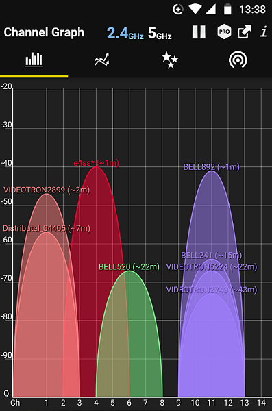
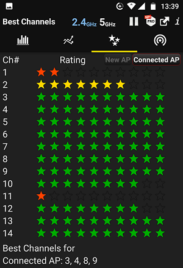

# Kinito.RaspberryPi
Kinito RaspberryPi Description

## Initial setup

1. Expand Filesystem: no need to do this — some may disagree on this point
2. Change User Password: recommended to change this, as using the default password can cause security concerns

3. Enable Boot to Desktop/Scratch: by default, this is set to console, which is what we want to keep

4. Internationalisation Options: set your timezone (if in the US, choose America, then find the correct city with your timezone)
5. Enable Camera: no (you can always change this later)
6. Add to Rastrack: no
7. Overclock: this is up to you, I usually choose Medium, which makes the Pi run a little bit faster at the expense of power and potential component damange
8. Advanced options: choose A4 SSH -- this will enable secure shell access, which means that you can control your Raspberry Pi from a remote computer (extremely useful)

## Update & upgrade system

```
sudo apt-get update
sudo apt-get upgrade
```

## Scan with AngryIP scanner

http://angryip.org/

https://nmap.org/download.html

## Improve your intrusion check

Android App 'Fing'

## Map network

Android App 'WiGLE WiFi'

## Improve your router channel settings

Use Android App 'WiFi Analyzer'


Look used channels | Look for the best signal
---------|----------
  | 


Check your new signal | Validate your new speed
---------|----------
  | 

http://www.canyouseeme.org/

## TO DO

https://rootsaid.com/home-automation-ubidots/

https://help.ubidots.com/iot-projects-tutorials/diy-raspberry-pi-temperature-system-with-ubidots

https://help.ubidots.com/connect-your-devices/connect-the-raspberry-pi-with-ubidots

https://github.com/ryudolow/GreenPi/wiki/Configure-your-Raspberry-Pi-to-use-Ubidots-Python-API-Client

https://www.min.at/prinz/?x=entry:entry150301-162949

https://www.min.at/prinz/?x=entry:entry160805-124148

https://www.hackster.io/dreamteam/gym-bud-with-fitbit-alexa-and-rpi-development-platform-a180c8
